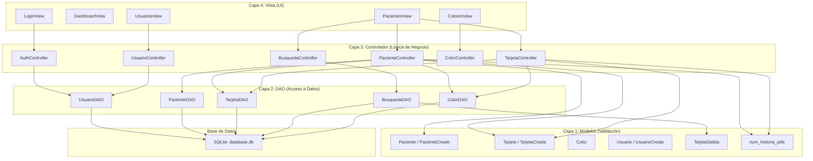
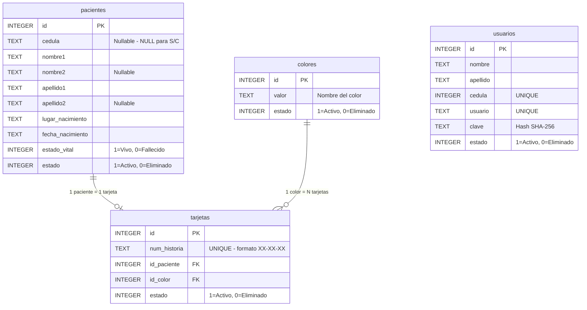
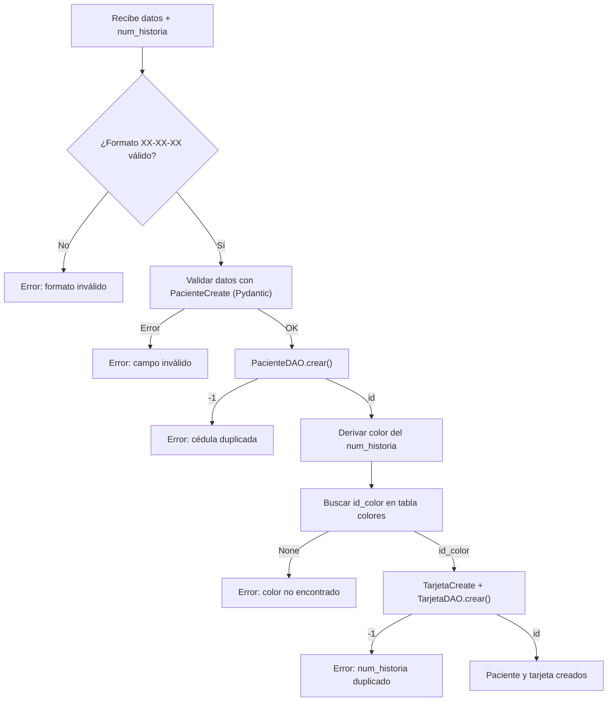
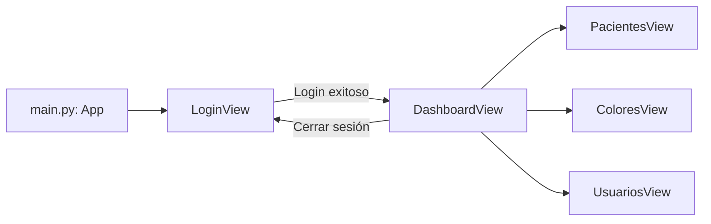
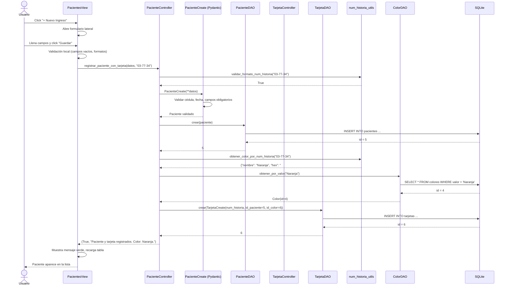

# 📋 Documentación Completa — SGI Salud

**Sistema de Gestión de Información Estadística y Registros de Salud**
Hospital Dr. Armando Delgado Montero (DADM)

---

## 1. Visión General

SGI Salud es una aplicación de escritorio que gestiona la información de pacientes y sus tarjetas de salud (tarjetas índice) en un hospital. Permite:

- **Buscar** pacientes por múltiples criterios
- **Registrar** nuevos pacientes junto con su tarjeta índice
- **Editar** y **desactivar** registros existentes
- **Asignar colores automáticamente** a las tarjetas según el número de historia
- **Gestionar usuarios** del sistema con autenticación segura

La aplicación está construida en **Python** usando **CustomTkinter** para la interfaz gráfica, **SQLite** como base de datos, y **Pydantic** para validación de datos.

---

## 2. Tecnologías Utilizadas

| Tecnología | Versión | Propósito |
|---|---|---|
| Python | 3.12+ | Lenguaje principal |
| CustomTkinter | 5.2.2 | Interfaz gráfica moderna (tema oscuro) |
| SQLite3 | (integrada) | Base de datos local, sin servidor |
| Pydantic | 2.13.4 | Validación y serialización de datos |

### Dependencias completas ([requirements.txt](file:///c:/Users/Ruisu/OneDrive/Escritorio/ProyectoComunitario/requirements.txt))

```
customtkinter==5.2.2
pydantic==2.13.4
darkdetect==0.8.0
packaging==26.2
pydantic_core==2.46.4
typing-inspection==0.4.2
typing_extensions==4.15.0
annotated-types==0.7.0
```

---

## 3. Estructura del Proyecto

```
ProyectoComunitario/
├── main.py                    ← Punto de entrada de la aplicación
├── seed.py                    ← Script para insertar datos de prueba
├── requirements.txt           ← Dependencias de Python
│
├── database/
│   ├── schema.sql             ← Esquema SQL (tablas, vista, índices)
│   └── database.db            ← Base de datos SQLite (se crea automáticamente)
│
└── src/                       ← Código fuente principal
    ├── models/                ← Modelos de datos (Pydantic)
    │   ├── paciente.py        ← Modelo de paciente con validaciones
    │   ├── tarjeta.py         ← Modelo de tarjeta índice
    │   ├── color.py           ← Modelo de color
    │   ├── usuario.py         ← Modelo de usuario del sistema
    │   ├── busqueda.py        ← Modelo de resultados de búsqueda
    │   └── num_historia_utils.py  ← Utilidades del número de historia y colores
    │
    ├── dao/                   ← Acceso a datos (Data Access Objects)
    │   ├── conexion.py        ← Conexión a SQLite
    │   ├── paciente.py        ← CRUD de pacientes
    │   ├── tarjeta.py         ← CRUD de tarjetas
    │   ├── color.py           ← CRUD de colores
    │   ├── usuario.py         ← CRUD de usuarios + autenticación
    │   └── busqueda.py        ← Consultas sobre la vista combinada
    │
    ├── controllers/           ← Lógica de negocio
    │   ├── auth_controller.py      ← Autenticación (login/logout)
    │   ├── paciente_controller.py  ← Gestión de pacientes + tarjetas
    │   ├── tarjeta_controller.py   ← Gestión de tarjetas individuales
    │   ├── busqueda_controller.py  ← Motor de búsqueda
    │   ├── color_controller.py     ← Referencia de colores
    │   └── usuario_controller.py   ← Gestión de usuarios
    │
    └── views/                 ← Interfaz gráfica (CustomTkinter)
        ├── login_view.py      ← Ventana de inicio de sesión
        ├── dashboard_view.py  ← Panel principal con menú lateral
        ├── pacientes_view.py  ← Módulo unificado: búsqueda + CRUD + tarjetas
        ├── colores_view.py    ← Referencia visual de colores
        └── usuarios_view.py   ← Administración de usuarios
```

---

## 4. Arquitectura de la Aplicación

El proyecto sigue una **arquitectura en capas (MVC modificado)** con 4 niveles:



### ¿Cómo fluyen los datos?

1. **El usuario** interactúa con la **Vista** (clics, formularios, búsquedas)
2. La Vista llama al **Controlador** con los datos ingresados
3. El Controlador **valida** los datos usando los **Modelos** (Pydantic)
4. Si la validación pasa, el Controlador llama al **DAO**
5. El DAO ejecuta la **consulta SQL** en la base de datos
6. El resultado sube de vuelta: DAO → Controlador → Vista → Usuario

---

## 5. Base de Datos

### 5.1 Motor

**SQLite** — base de datos embebida en un archivo local (`database/database.db`). No necesita instalar ningún servidor.

### 5.2 Esquema de Tablas

El esquema se define en [schema.sql](file:///c:/Users/Ruisu/OneDrive/Escritorio/ProyectoComunitario/database/schema.sql):



### 5.3 Detalle de cada tabla

#### Tabla `pacientes`

| Campo | Tipo | Restricción | Descripción |
|---|---|---|---|
| `id` | INTEGER | PK, AUTOINCREMENT | Identificador único |
| `cedula` | TEXT | Nullable | Cédula del paciente. `NULL` para niños sin cédula |
| `nombre1` | TEXT | NOT NULL | Primer nombre |
| `nombre2` | TEXT | Nullable | Segundo nombre (opcional) |
| `apellido1` | TEXT | NOT NULL | Primer apellido |
| `apellido2` | TEXT | Nullable | Segundo apellido (opcional) |
| `lugar_nacimiento` | TEXT | NOT NULL | Ciudad/localidad de nacimiento |
| `fecha_nacimiento` | TEXT | NOT NULL | Formato DD/MM/AAAA |
| `estado_vital` | INTEGER | NOT NULL | `1` = Vivo, `0` = Fallecido |
| `estado` | INTEGER | NOT NULL | `1` = Activo, `0` = Eliminado (borrado lógico) |

> [!IMPORTANT]
> La columna `cedula` **no tiene restricción UNIQUE**. Esto permite que múltiples pacientes tengan `NULL` (niños sin cédula, mostrados como "S/C" en la interfaz).

#### Tabla `tarjetas`

| Campo | Tipo | Restricción | Descripción |
|---|---|---|---|
| `id` | INTEGER | PK, AUTOINCREMENT | Identificador único |
| `num_historia` | TEXT | NOT NULL, UNIQUE | Número de historia clínica (formato XX-XX-XX) |
| `id_paciente` | INTEGER | NOT NULL, FK | Referencia al paciente |
| `id_color` | INTEGER | NOT NULL, FK | Referencia al color asignado |
| `estado` | INTEGER | NOT NULL | `1` = Activa, `0` = Eliminada |

> [!IMPORTANT]
> Cada paciente puede tener **máximo 1 tarjeta activa** (relación 1:1). El sistema valida esto antes de crear una nueva.

#### Tabla `colores`

| Campo | Tipo | Descripción |
|---|---|---|
| `id` | INTEGER | PK, AUTOINCREMENT |
| `valor` | TEXT | Nombre del color (ej: "Naranja") |
| `estado` | INTEGER | `1` = Activo, `0` = Eliminado |

Los 10 colores se insertan al ejecutar el `seed.py`:

| ID | Nombre | Rango del último par | Código HEX |
|---|---|---|---|
| 1 | Marron | 00 - 09 | `#8B4513` |
| 2 | Azul Marino | 10 - 19 | `#000080` |
| 3 | Verde | 20 - 29 | `#228B22` |
| 4 | Naranja | 30 - 39 | `#FF8C00` |
| 5 | Morado | 40 - 49 | `#800080` |
| 6 | Rosa | 50 - 59 | `#FF69B4` |
| 7 | Turquesa | 60 - 69 | `#40E0D0` |
| 8 | Amarillo | 70 - 79 | `#FFD700` |
| 9 | Rojo | 80 - 89 | `#DC143C` |
| 10 | Azul Celeste | 90 - 99 | `#87CEEB` |

#### Tabla `usuarios`

| Campo | Tipo | Restricción | Descripción |
|---|---|---|---|
| `id` | INTEGER | PK | Identificador |
| `nombre` | TEXT | NOT NULL | Nombre del operador |
| `apellido` | TEXT | NOT NULL | Apellido del operador |
| `cedula` | INTEGER | NOT NULL, UNIQUE | Cédula del operador (numérica) |
| `usuario` | TEXT | NOT NULL, UNIQUE | Nombre de usuario para login |
| `clave` | TEXT | NOT NULL | Contraseña hasheada (SHA-256) |
| `estado` | INTEGER | | `1` = Activo, `0` = Desactivado |

### 5.4 Vista SQL: `vista_paciente_tarjeta`

Esta vista combina las 3 tablas (pacientes + tarjetas + colores) para las búsquedas:

```sql
CREATE VIEW vista_paciente_tarjeta AS
SELECT
    pacientes.id AS id_paciente,
    pacientes.nombre1,
    pacientes.nombre2,
    pacientes.apellido1,
    pacientes.apellido2,
    COALESCE(pacientes.cedula, 'S/C') AS cedula,
    pacientes.fecha_nacimiento,
    pacientes.lugar_nacimiento,
    pacientes.estado_vital,
    tarjetas.num_historia,
    colores.valor AS color
FROM pacientes
JOIN tarjetas ON pacientes.id = tarjetas.id_paciente
JOIN colores ON colores.id = tarjetas.id_color
WHERE pacientes.estado = 1;
```

> [!NOTE]
> `COALESCE(pacientes.cedula, 'S/C')` convierte los `NULL` en el texto "S/C" para que la interfaz los muestre correctamente.

### 5.5 Borrado Lógico

El sistema **nunca elimina registros** físicamente. En su lugar, cambia el campo `estado` de `1` a `0`. Esto se conoce como **soft delete** o borrado lógico. Las consultas siempre filtran con `WHERE estado = 1`.

---

## 6. Capa de Modelos (Validación)

Los modelos usan **Pydantic** para validar automáticamente los datos antes de guardarlos.

### 6.1 Modelo Paciente — [paciente.py](file:///c:/Users/Ruisu/OneDrive/Escritorio/ProyectoComunitario/src/models/paciente.py)

```
PacienteBase (validaciones)
    ├── PacienteCreate (para insertar nuevos)
    └── Paciente (con id, para leer de BD)
```

**Validaciones automáticas:**

| Campo | Regla | Ejemplo válido | Ejemplo inválido |
|---|---|---|---|
| `cedula` | Regex `^[VvEe]-\d{6,10}$` o vacío/"S/C" | `V-12345678`, `E-98765432`, `S/C` | `12345678`, `V12345`, `X-123` |
| `fecha_nacimiento` | Regex `^\d{2}[/\-]\d{2}[/\-]\d{4}$` + lógica | `21/02/2000`, `15-03-1985` | `2000-02-21`, `31/13/2020` |
| `nombre1` | No puede estar vacío | `"Maria"` | `""` |
| `apellido1` | No puede estar vacío | `"Gonzalez"` | `""` |
| `lugar_nacimiento` | No puede estar vacío | `"Barquisimeto"` | `""` |

**Normalización automática:**
- La cédula se convierte a mayúscula: `v-123` → `V-123`
- La fecha normaliza separadores: `21-02-2000` → `21/02/2000`
- Los espacios se recortan automáticamente

### 6.2 Modelo Tarjeta — [tarjeta.py](file:///c:/Users/Ruisu/OneDrive/Escritorio/ProyectoComunitario/src/models/tarjeta.py)

```
TarjetaBase (validación de num_historia)
    ├── TarjetaCreate (para insertar)
    └── Tarjeta (con id, para leer)
```

**Validación:**

| Campo | Regla | Ejemplo válido | Ejemplo inválido |
|---|---|---|---|
| `num_historia` | Regex `^\d{2}-\d{2}-\d{2}$` | `03-77-34` | `3-77-34`, `037734`, `AA-BB-CC` |

### 6.3 Modelo TarjetaSalida — [busqueda.py](file:///c:/Users/Ruisu/OneDrive/Escritorio/ProyectoComunitario/src/models/busqueda.py)

Modelo de **solo lectura** para los resultados de búsqueda. Combina datos de paciente + tarjeta + color:

```python
class TarjetaSalida(BaseModel):
    id_paciente: int    # Identificador único del paciente
    cedula: str         # "V-12345678" o "S/C"
    nombre1: str
    nombre2: str | None
    apellido1: str
    apellido2: str | None
    fecha_nacimiento: str
    lugar_nacimiento: str
    estado_vital: int   # 1 o 0
    num_historia: str   # "03-77-34"
    color: str          # "Naranja"
```

### 6.4 Utilidades de Número de Historia — [num_historia_utils.py](file:///c:/Users/Ruisu/OneDrive/Escritorio/ProyectoComunitario/src/models/num_historia_utils.py)

Este módulo contiene la **lógica central del sistema de colores**:

#### ¿Cómo funciona la asignación de color?

El número de historia tiene formato **XX-XX-XX** (3 pares de dígitos). El **último par** determina el color:

```
Número: 03-77-34
                ^^
                |
                └── Último par = 34
                    Primer dígito = 3
                    Decena = 30
                    Color = Naranja (#FF8C00)
```

**Regla:** Se toma el **primer dígito del último par** (la decena) y se busca en el mapa:

| Decena | Rango | Color |
|---|---|---|
| 0 | 00-09 | Marrón |
| 1 | 10-19 | Azul Marino |
| 2 | 20-29 | Verde |
| 3 | 30-39 | Naranja |
| 4 | 40-49 | Morado |
| 5 | 50-59 | Rosa |
| 6 | 60-69 | Turquesa |
| 7 | 70-79 | Amarillo |
| 8 | 80-89 | Rojo |
| 9 | 90-99 | Azul Celeste |

**Funciones disponibles:**

| Función | Entrada | Salida |
|---|---|---|
| `validar_formato_num_historia("03-77-34")` | String | `True` o `False` |
| `obtener_color_por_num_historia("03-77-34")` | String | `{"nombre": "Naranja", "hex": "#FF8C00"}` |
| `obtener_nombre_color("03-77-34")` | String | `"Naranja"` |

---

## 7. Capa DAO (Acceso a Datos)

Los DAOs son las clases que **hablan directamente con la base de datos**. Cada tabla tiene su propio DAO.

### 7.1 Conexión — [conexion.py](file:///c:/Users/Ruisu/OneDrive/Escritorio/ProyectoComunitario/src/dao/conexion.py)

```python
class ConexionDB:
    def __init__(self, db_path="database/database.db"):
        self.db_path = db_path

    def obtener_conexion(self):
        return sqlite3.connect(self.db_path)
```

Todos los DAOs usan esta clase para obtener conexiones. Cada operación abre y cierra su propia conexión.

### 7.2 PacienteDAO — [paciente.py](file:///c:/Users/Ruisu/OneDrive/Escritorio/ProyectoComunitario/src/dao/paciente.py)

| Método | Descripción | Retorna |
|---|---|---|
| `crear(paciente)` | Inserta un paciente. Convierte "S/C" a NULL | `int` (id) o `-1` si duplicado |
| `obtener_por_id(id)` | Busca por ID. Convierte NULL a "S/C" | `Paciente` o `None` |
| `obtener_por_cedula(cedula)` | Busca por cédula | `Paciente` o `None` |
| `obtener_todos()` | Lista pacientes activos | `list[Paciente]` |
| `actualizar(id, paciente)` | Actualiza datos. Convierte "S/C" a NULL | `bool` |
| `soft_delete(id)` | Desactiva (estado = 0) | `bool` |

> [!TIP]
> El método `_fila_a_paciente()` convierte automáticamente `NULL` → `"S/C"` al leer de la BD, y `crear()`/`actualizar()` convierten `"S/C"` → `NULL` al escribir. El usuario siempre ve "S/C" pero la BD almacena NULL.

### 7.3 TarjetaDAO — [tarjeta.py](file:///c:/Users/Ruisu/OneDrive/Escritorio/ProyectoComunitario/src/dao/tarjeta.py)

| Método | Descripción | Retorna |
|---|---|---|
| `crear(tarjeta)` | Inserta tarjeta | `int` (id) o `-1` si num_historia duplicado |
| `obtener_por_paciente(id)` | Busca la tarjeta de un paciente | `Tarjeta` o `None` |
| `obtener_por_id(id)` | Busca por ID de tarjeta | `Tarjeta` o `None` |
| `obtener_todos()` | Lista tarjetas activas | `list[Tarjeta]` |
| `obtener_por_num_historia(nh)` | Busca por número de historia | `Tarjeta` o `None` |
| `paciente_tiene_tarjeta(id)` | ¿Ya tiene tarjeta? | `bool` |
| `actualizar(id, tarjeta)` | Actualiza num_historia y color | `bool` |
| `soft_delete(id)` | Desactiva | `bool` |

### 7.4 BusquedaDAO — [busqueda.py](file:///c:/Users/Ruisu/OneDrive/Escritorio/ProyectoComunitario/src/dao/busqueda.py)

Consulta la **vista SQL** `vista_paciente_tarjeta` que combina pacientes + tarjetas + colores:

| Método | Busca por | SQL |
|---|---|---|
| `obtener_todos()` | Todo | `SELECT * FROM vista_paciente_tarjeta` |
| `buscar_por_cedula(v)` | Cédula (parcial) | `WHERE cedula LIKE '%v%'` |
| `buscar_por_nombre_completo(v)` | Nombre o apellido | `WHERE nombre1 LIKE ... OR apellido1 LIKE ...` |
| `buscar_por_apellido(v)` | Apellido | `WHERE apellido1 LIKE ... OR apellido2 LIKE ...` |
| `buscar_por_fecha_nacimiento(v)` | Fecha | `WHERE fecha_nacimiento LIKE '%v%'` |
| `buscar_por_lugar_nacimiento(v)` | Lugar | `WHERE lugar_nacimiento LIKE '%v%'` |

### 7.5 UsuarioDAO — [usuario.py](file:///c:/Users/Ruisu/OneDrive/Escritorio/ProyectoComunitario/src/dao/usuario.py)

| Método | Descripción | Detalle especial |
|---|---|---|
| `crear(usuario)` | Registra usuario | Hashea la contraseña con SHA-256 |
| `obtener_todos()` | Lista usuarios activos | No incluye campo `clave` |
| `actualizar(id, usuario)` | Actualiza datos | Re-hashea la nueva contraseña |
| `soft_delete(id)` | Desactiva | Borrado lógico |
| `validar_credenciales(usuario, clave)` | Login | Compara hash almacenado vs ingresado |

### 7.6 ColorDAO — [color.py](file:///c:/Users/Ruisu/OneDrive/Escritorio/ProyectoComunitario/src/dao/color.py)

| Método | Descripción |
|---|---|
| `obtener_todos()` | Lista los 10 colores activos |
| `obtener_por_valor(nombre)` | Busca color por nombre (ej: "Naranja") |
| `obtener_por_id(id)` | Busca color por ID |

---

## 8. Capa de Controladores (Lógica de Negocio)

Los controladores **orquestan** las operaciones: validan, coordinan entre DAOs, y devuelven resultados a las vistas.

### 8.1 AuthController — [auth_controller.py](file:///c:/Users/Ruisu/OneDrive/Escritorio/ProyectoComunitario/src/controllers/auth_controller.py)

```python
# Login
ok, mensaje = auth_ctrl.login("admin", "admin123")
# ok = True, mensaje = "Bienvenido/a, Admin Sistema."

# Obtener usuario actual
usuario = auth_ctrl.obtener_usuario_actual()

# Logout
auth_ctrl.logout()
```

**Flujo de autenticación:**
1. Recibe usuario y contraseña en texto plano
2. Valida que los campos no estén vacíos
3. Llama a `UsuarioDAO.validar_credenciales()` que hashea la contraseña y la compara
4. Si coincide, guarda el `Usuario` en `self.usuario_actual`

### 8.2 PacienteController — [paciente_controller.py](file:///c:/Users/Ruisu/OneDrive/Escritorio/ProyectoComunitario/src/controllers/paciente_controller.py)

Este es el **controlador más importante**. Maneja:

#### Registrar paciente con tarjeta (operación atómica)

```python
ok, msg = pac_ctrl.registrar_paciente_con_tarjeta(
    datos_paciente={
        "cedula": "V-12345678",
        "nombre1": "Maria",
        "nombre2": "Elena",
        "apellido1": "Gonzalez",
        "apellido2": "Perez",
        "fecha_nacimiento": "15/03/1985",
        "lugar_nacimiento": "Barquisimeto",
        "estado_vital": 1,
    },
    num_historia="03-77-34"
)
```

**Flujo interno:**



#### Otros métodos

| Método | Descripción | Retorna |
|---|---|---|
| `registrar_paciente(datos)` | Solo paciente, sin tarjeta | `(bool, str, int\|None)` |
| `obtener_paciente(id)` | Por ID, con tupla | `(bool, str\|Paciente)` |
| `obtener_paciente_por_id(id)` | Por ID, directo | `Paciente\|None` |
| `obtener_paciente_por_cedula(ced)` | Por cédula | `(bool, str\|Paciente)` |
| `listar_pacientes()` | Todos activos | `list[Paciente]` |
| `actualizar_paciente(id, datos)` | Actualiza | `(bool, str)` |
| `eliminar_paciente(id)` | Soft delete | `(bool, str)` |

### 8.3 TarjetaController — [tarjeta_controller.py](file:///c:/Users/Ruisu/OneDrive/Escritorio/ProyectoComunitario/src/controllers/tarjeta_controller.py)

| Método | Descripción | Detalle |
|---|---|---|
| `crear_tarjeta(id_pac, nh)` | Crea tarjeta | Auto-deriva color, verifica 1:1 |
| `actualizar_tarjeta(id_tarj, nh)` | Actualiza | Recalcula color si cambia num_historia |
| `obtener_tarjeta_paciente(id_pac)` | Tarjeta de un paciente | Relación 1:1 |
| `listar_tarjetas()` | Todas activas | Lista completa |
| `eliminar_tarjeta(id_tarj)` | Soft delete | Borrado lógico |

### 8.4 BusquedaController — [busqueda_controller.py](file:///c:/Users/Ruisu/OneDrive/Escritorio/ProyectoComunitario/src/controllers/busqueda_controller.py)

```python
# Buscar por nombre completo
ok, resultados = busq_ctrl.buscar("nombre_completo", "Maria")

# Criterios disponibles:
# "todos", "cedula", "nombre_completo", "apellido",
# "fecha_nacimiento", "lugar_nacimiento"
```

---

## 9. Capa de Vistas (Interfaz Gráfica)

### 9.1 Flujo de Ventanas



### 9.2 LoginView — [login_view.py](file:///c:/Users/Ruisu/OneDrive/Escritorio/ProyectoComunitario/src/views/login_view.py)

Ventana de inicio de sesión con:
- Campo de usuario
- Campo de contraseña (oculta con `*`)
- Botón "Iniciar Sesión"
- Mensajes de error en rojo

Al autenticarse, se destruye el login y se abre el dashboard.

### 9.3 DashboardView — [dashboard_view.py](file:///c:/Users/Ruisu/OneDrive/Escritorio/ProyectoComunitario/src/views/dashboard_view.py)

Panel principal con:

- **Menú lateral izquierdo** con botones:
  - 📊 Inicio
  - 👤 Pacientes
  - 🎨 Colores
  - 👥 Usuarios
- **Área de contenido** a la derecha donde se cargan los módulos
- **Info del usuario** logueado abajo a la izquierda
- **Botón "Cerrar Sesión"** en rojo

### 9.4 PacientesView — [pacientes_view.py](file:///c:/Users/Ruisu/OneDrive/Escritorio/ProyectoComunitario/src/views/pacientes_view.py)

> [!IMPORTANT]
> Este es el **módulo más importante**. Unifica búsqueda, listado y registro de pacientes con tarjetas en una sola pantalla.

**Layout:**

```
┌──────────────────────────────────────────────────────────┐
│ Buscar: [Todos ▼] [__________________] [Buscar] [+Nuevo]│  ← Barra compacta
├──────────────────────────────────────────────────────────┤
│ mensaje de estado                          5 resultados  │
├─────────────────────────────────┬────────────────────────┤
│  Tabla de resultados            │  Formulario (dinámico) │
│  Cedula | Nombre | F.Nac | ... │  DATOS DEL PACIENTE    │
│  V-123  | Maria G | 15/03 |    │  Cedula [V-▼][_____]   │
│  S/C    | Luis P  | 10/05 |    │  Nombre1 [___________] │
│                                 │  ...                   │
│                                 │  TARJETA INDICE        │
│                                 │  N. Historia [__-__-__]│
│                                 │  [■ Naranja]           │
└─────────────────────────────────┴────────────────────────┘
```

**Comportamientos clave:**

1. **Al cargar**: muestra todos los pacientes (con tarjeta) en la tabla
2. **Buscar**: filtra por criterio seleccionado
3. **"+ Nuevo Ingreso"**: abre el formulario lateral (la tabla se comprime al 55%)
4. **Click en fila**: carga los datos en el formulario para editar
5. **Sin resultados**: muestra botón "Registrar Nuevo Paciente"
6. **Cerrar formulario**: la tabla vuelve al 100% del ancho

**Selector de cédula:**
- Dropdown con opciones: **V-**, **E-**, **S/C**
- Al seleccionar **S/C**, el campo numérico se desactiva
- La cédula se compone automáticamente: `tipo + número` → `V-12345678`

**Preview de color en vivo:**
- Al escribir el N. de Historia, un cuadrado de color y el nombre se actualizan en tiempo real
- Si el formato es incorrecto, muestra "Formato requerido: XX-XX-XX"

**Mensajes de error específicos:**
```
• Cedula: ingrese el número o seleccione S/C.
• Primer Nombre: campo obligatorio.
• Fecha Nac.: formato inválido. Ejemplo: 21/02/2000.
• N. Historia: use 3 pares de dígitos (ej: 03-77-34).
```

### 9.5 ColoresView — [colores_view.py](file:///c:/Users/Ruisu/OneDrive/Escritorio/ProyectoComunitario/src/views/colores_view.py)

Vista de **solo lectura** que muestra los 10 colores en una cuadrícula visual con:
- Cuadrado grande de color (60x60px)
- Nombre del color
- Rango de números que corresponden

### 9.6 UsuariosView — [usuarios_view.py](file:///c:/Users/Ruisu/OneDrive/Escritorio/ProyectoComunitario/src/views/usuarios_view.py)

CRUD de usuarios del sistema con tabla + formulario:
- Campos: nombre, apellido, cédula (numérica), usuario, contraseña
- La contraseña se muestra con `*` y se hashea con SHA-256 al guardar

---

## 10. Paleta de Colores de la Interfaz

| Variable | Color | Uso |
|---|---|---|
| `COLOR_BG` | `#0F1923` | Fondo general |
| `COLOR_PANEL` | `#182633` | Paneles y tarjetas |
| `COLOR_ACCENT` | `#00A8E8` | Botones y acentos |
| `COLOR_ACCENT_HOVER` | `#007BB5` | Hover de botones |
| `COLOR_TEXT` | `#E8EDF2` | Texto principal |
| `COLOR_TEXT_SEC` | `#8899AA` | Texto secundario |
| `COLOR_ENTRY_BG` | `#1E3044` | Fondo de campos de texto |
| `COLOR_ENTRY_BORDER` | `#2A4158` | Borde de campos |
| `COLOR_ERROR` | `#FF4C6A` | Mensajes de error |
| `COLOR_SUCCESS` | `#00D68F` | Mensajes de éxito |
| `COLOR_DANGER` | `#FF4C6A` | Botón eliminar |
| `COLOR_ROW_ALT` | `#1A2D3D` | Filas alternadas en tablas |

Tipografía: **Segoe UI** en todos los componentes.

---

## 11. Flujo Completo: Registrar un Paciente Nuevo

Este es el flujo paso a paso de la operación más común:



---

## 12. Reglas de Negocio

| Regla | Detalle |
|---|---|
| **1 paciente = 1 tarjeta** | Un paciente solo puede tener una tarjeta activa |
| **Paciente sin tarjeta = no aparece en búsqueda** | La vista SQL usa `JOIN`, no `LEFT JOIN` |
| **Color automático** | Se deriva del último par del número de historia, nunca se elige manualmente |
| **S/C para niños** | Los pacientes sin cédula se almacenan con `NULL` en la BD. Pueden haber múltiples |
| **Borrado lógico** | Nunca se eliminan registros, solo se desactivan (`estado = 0`) |
| **Contraseñas hasheadas** | Se almacenan como SHA-256, nunca en texto plano |
| **Num_historia único** | No puede haber dos tarjetas con el mismo número de historia |

---

## 13. Guía de Instalación y Ejecución

### Requisitos previos
- Python 3.12 o superior instalado

### Pasos

```bash
# 1. Clonar o abrir el proyecto
cd ProyectoComunitario

# 2. Crear entorno virtual
python -m venv .venv

# 3. Activar entorno virtual (Windows)
.venv\Scripts\activate

# 4. Instalar dependencias
pip install -r requirements.txt

# 5. Insertar datos de prueba (crea la BD + colores + usuarios + pacientes)
python seed.py

# 6. Ejecutar la aplicación
python main.py
```

### Credenciales de prueba

| Usuario | Contraseña | Tipo |
|---|---|---|
| `admin` | `admin123` | Administrador |
| `jperez` | `1234` | Usuario regular |

### Pacientes de prueba (insertados por seed.py)

| Cédula | Nombre | N. Historia | Color |
|---|---|---|---|
| V-12345678 | María Elena González Pérez | 03-77-34 | Naranja |
| V-87654321 | Carlos Alberto Rodríguez López | 15-22-80 | Rojo |
| V-11223344 | Ana Martínez García | 42-01-15 | Azul Marino |
| S/C | Luis Miguel Pérez Gómez | 08-55-02 | Marrón |

---

## 14. Glosario

| Término | Significado |
|---|---|
| **DAO** | Data Access Object — clase que encapsula el acceso a la base de datos |
| **MVC** | Model-View-Controller — patrón arquitectónico de separación de responsabilidades |
| **Pydantic** | Librería de validación de datos que usa type hints de Python |
| **CustomTkinter** | Extensión moderna de Tkinter con widgets con estilo (tema oscuro) |
| **Soft Delete** | Borrado lógico — marcar registros como inactivos en vez de eliminarlos |
| **SHA-256** | Algoritmo de hash criptográfico para almacenar contraseñas de forma segura |
| **Tarjeta Índice** | Ficha de identificación del paciente con número de historia y color asignado |
| **N. Historia** | Número de historia clínica en formato XX-XX-XX (3 pares de dígitos) |
| **S/C** | "Sin Cédula" — identificador para pacientes (generalmente niños) sin documento de identidad |
